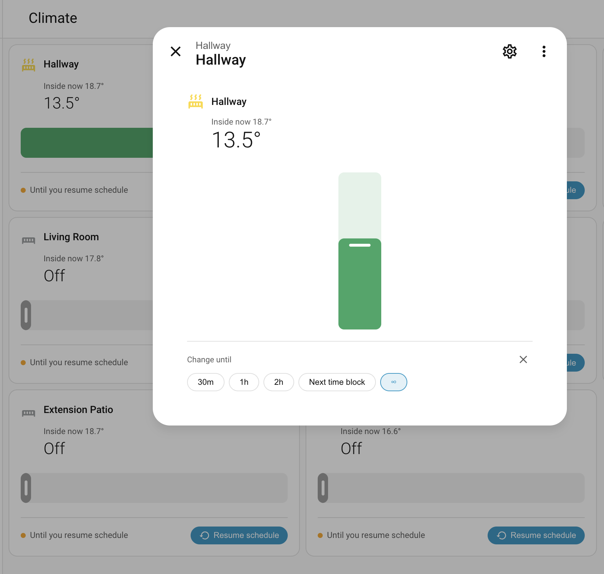

# HA-Tado



A Home Assistant custom card and more-info dialog for Tado climate
zones, with first-class support for schedule overrides ("overlays").

The stock Home Assistant Tado integration exposes overlay controls only
through service calls. This project surfaces them in the UI: when a zone
is overridden, the card shows the override status and termination
condition, and provides a one-tap "Resume schedule" action plus a chip
picker for choosing the override duration (30m / 1h / 2h / Until next
time block / Indefinite).

## Components

- **`tado-climate-card`** — a dashboard card. Shows current and target
  temperature, a coloured slider (off → max), and an overlay strip when
  an override is active. Tapping anywhere on the card opens the more-info
  popup, except the Resume button which acts directly.
- **`tado-more-info-climate`** — replaces the default more-info popup
  for any climate entity that exposes Tado attributes. Larger
  temperature display, vertical slider, and an inline duration picker.
- **`tado-overlay-strip`** — shared strip that renders the active
  override's termination plus a Resume button. Used by the dashboard
  card and the popup.

## Per-user preferences

The popup's chip picker remembers your last duration choice per zone,
stored via Home Assistant's `frontend/set_user_data` API — server-side
and per-user, so it follows you across devices and browsers. The
default chip is "Until next time block" until you choose otherwise.

Slider temperature changes from the dashboard card always apply with
"Until next time block" termination, regardless of the stored
preference. The preference only governs the chip picker default and
slider commits inside the popup.

## Installation

1. Copy `dist/tado-climate-card.js` to your HA `config/www/` directory.
2. Add it as a dashboard resource:
   *Settings → Dashboards → Resources → Add → URL `/local/tado-climate-card.js`, type Module.*
3. Optionally add `custom:tado-climate-card` cards to your dashboards.
   The more-info patch applies automatically to all climate entities
   whose attributes look Tado-shaped.

## No integration patch required

The Resume button calls `climate.set_hvac_mode: auto`, which the stock
Home Assistant Tado integration maps to "resume smart schedule" by
resetting the zone overlay. The card therefore works on any HA install
with the built-in Tado integration — no `custom_components/` patching
needed.

This repo does ship a fork of HA's built-in `tado` integration in
`ha-dev/config/custom_components/tado/`. It exists for two reasons:
local development against the integration's source, and as the basis
for an upstream contribution that adds a `tado.resume_schedule`
service. The card no longer depends on that service; it's just a
clearer name for what the stock `set_hvac_mode: auto` already does.

## Development

```bash
npm install
npm run dev      # Vite watch mode
npm run build    # one-shot build into dist/
npm test         # vitest run
```

A development HA instance lives in `ha-dev/`:

```bash
cd ha-dev
./run.sh         # starts HA pointing at config/
```

The dev configuration loads the built card from `config/www/` with a
versioned cache-buster (`?v=N` in `configuration.yaml`). Bump `N` after
a build to force the browser to reload the bundle.

## Project layout

```
src/
  index.ts                      # entry: registers card and patches more-info
  tado-climate-card.ts          # dashboard card
  tado-more-info-climate.ts     # popup replacement
  tado-overlay-strip.ts         # shared override status strip
  user-prefs.ts                 # frontend.set_user_data wrapper
  heating-color.ts              # radiator icon colouring
  slider-color.ts               # temperature → slider colour
  types.ts                      # HA / entity / config types
ha-dev/
  config/                       # local HA instance
    custom_components/tado/     # forked Tado integration
    www/                        # built card lives here
    configuration.yaml
```

## Status

Pre-1.0. APIs and storage shapes may change without notice. Tested
against Home Assistant 2024.x and the Tado integration shipped therein.
